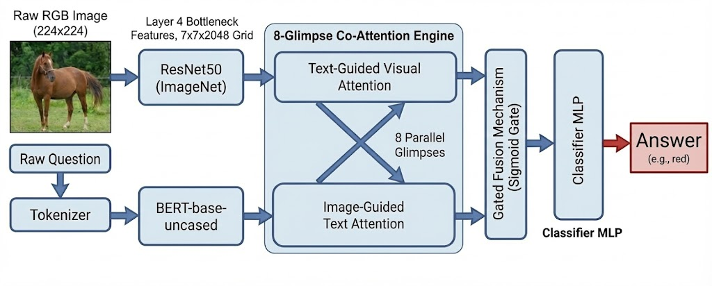

# 🖼️ Visual Question Answering (VQA) System


## 📖 Project Overview
Visual Question Answering (VQA) is a multimodal AI challenge that requires a computer to understand an image and answer natural language questions about it. This project implements a **Multi-Glimpse Co-Attention Network**, a custom architecture designed to mimic human visual reasoning.

By fusing **ResNet50** (vision) and **BERT** (language) through an 8-head attention mechanism, the model learns to "look" at specific regions of an image relevant to the text query, achieving **55% Soft Accuracy** on the VQA v2.0 validation set. This system is fully deployed with a **Streamlit** frontend for real-time interaction.

## 📍 Table of Contents

- [Project Overview](#-project-overview)
- [Video Demo](#-video-demo)
- [Objective](#-objective)
- [Architecture Overview](#%EF%B8%8F-architecture-overview)
- [Project Chronicle (Approach)](#-project-chronicle-8-glimpse-vqa-system)
- [Results & Metrics](#-results--metrics)
- [Real-World Applications](#-real-world-applications)
- [Key Learning Outcomes](#-key-learning-outcomes)
- [Project Structure](#-project-structure)
- [Getting Started](#-getting-started)
- [Usage](#-usage)
- [Technical Details](#-technical-details)
- [References](#-references)

---


## 🎥 Video Demo


https://github.com/user-attachments/assets/a97b96e3-d94f-4359-a43e-0c6482aff818


---


## 🎯 Objective
**To build a  Visual Question Answering (VQA) system that accurately answers natural language questions about images by deeply integrating visual and textual features.**

The primary goal is to overcome the limitations of simple concatenation-based models by implementing an **8-Glimpse Multi-Head Attention** mechanism. This allows the model to reason about complex scenes by focusing on multiple distinct regions of an image simultaneously, much like human peripheral and foveal vision.


## 🏗️ Architecture Overview



### Feature Extraction
*   **Image Encoder:** ResNet50 (pretrained on ImageNet), preserving $7 \times 7$ grid.
*   **Text Encoder:** BERT-base-uncased for semantic understanding.

### Alignment Model (The 8-Glimpse Engine)
*   **Attention:** 8-Head Multi-Head Attention allowing simultaneous focus on multiple regions.
*   **Fusion:** Gated fusion mechanism combining visual and textual contexts.

### Classification Head
*   **Classifier:** Fully connected layers predicting the answer index.

---

## 📅 Project Chronicle: 8-Glimpse VQA System

This project evolved through rigorous experimentation and architectural refinements. Here is the story of how I achieved the final performance:

### 1. The Shift to Spatial Attention (Cross-Attention) 🔍
To restore spatial fidelity lost in earlier flattened approaches, I fundamentally altered the architecture. I removed the flattening layer and kept the $7 \times 7$ grid (49 spatial regions) intact.
*   **Architecture Change:** I implemented a **Cross-Attention** mechanism. The Question Vector (Query) was projected to scan the 49 image regions (Keys/Values).
*   **Result:** This allowed the model to calculate a weighted sum of the image, focusing only on regions relevant to the question.
*   **Training Phase:** I ran this architecture for approximately **10 epochs** . This phase was crucial for learning the **Projection Layers**—teaching the model how to map the 2048-dim visual space and 768-dim text space into a shared 512-dim latent space.

### 2. The Bottleneck: Single-Head Co-Attention 🔄
While Cross-Attention improved performance, I observed a "single-focus" bottleneck. The model could only focus on *one* dominant region of the image at a time. For complex questions like *"What color is the shirt of the man holding the bat?"*, the model needed to track multiple objects (shirt, man, bat) simultaneously.
*   **Architecture Change:** I upgraded to a **Co-Attention** framework, where the attended visual features were fed back to re-weight the text, creating a bi-directional reasoning loop.
*   **Training Phase:** I refined this Single-Head model for another **10+ epochs** . I heavily regularized this phase to ensure the semantic alignment between text and image was robust before adding more complexity.

### 3. The Final Leap: 8-Glimpse Multi-Head Attention 🐙
To solve the bottleneck, I scaled the architecture to use **8 Parallel Attention Heads** (or "Glimpses").
*   **The Concept:** Just as human vision saccades (jumps) to different points, I wanted the model to take 8 distinct "glimpses" of the image at once.
    *   *Head 1-2* might focus on object detection (noun mapping).
    *   *Head 3-4* might focus on attributes (color/texture).
    *   *Head 5-8* might capture background context.
*   **Implementation Strategy:** Training 8 heads from scratch is unstable. I employed **Representation Transfer**:
    1.  I initialized the Encoders and Projection layers using the stable weights from the Single-Head phase.
    2.  I trained the new 8-head attention layer with a reduced learning rate ($1e-5$).
*   **Training Phase:** This final fine-tuning stage lasted approximately **15 epochs** , pushing the model to a peak **Soft Accuracy of 55%**.

---

## 📊 Results & Metrics

| Metric | Score |
|:-------|:------|
| **Strict Accuracy** | **46.00%** |
| **Soft Accuracy (Validation)** | **55.00%** |

> **Note**: Soft Accuracy uses the official VQA evaluation metric: `min(#humans_who_gave_answer / 3, 1)`

---

## 🌍 Real-World Applications
This VQA architecture has potential impacts in several domains:
* **Accessibility:** Assisting visually impaired users by answering questions about their surroundings (e.g., "Is this bottle of medicine expired?").
* **Surveillance:** Automating video analysis to detect anomalies based on text queries.
* **E-Commerce:** allowing users to search for products using specific visual attributes (e.g., "Show me the red sneakers with white laces").

## 🧠 Key Learning Outcomes
Through building this system from scratch, I gained deep expertise in:
1.  **Multimodal Fusion:** Learned how to mathematically project disparate vector spaces (Text $\in \mathbb{R}^{768}$ vs. Image $\in \mathbb{R}^{2048}$) into a shared latent space.
2.  **Attention Mechanisms:** Implemented Co-Attention and Multi-Head Attention manually in PyTorch, moving beyond "black box" implementations.
3.  **Dimensionality Management:** Mastered the handling of high-dimensional tensors (`[Batch, Heads, Seq_Len, Features]`) and broadcasting operations.
4.  **Full-Stack ML Deployment:** Bridged the gap between a research notebook and a  Web App using Streamlit.

---

## 📁 Project Structure
Here is the organization of the codebase:

```text
vqa_v2_ds/
├── app.py                  # Streamlit Web App
├── evaluation.py           # Evaluation Script
├── train.py                # Main Training Script
├── infer.py                # Command-line Inference
├── checkpoints/            # Saved model weights
├── data/                   # Data directory (see Getting Started)
├── datasets/               # Dataset Loading Logic
├── models/                 # Model Architecture
└── utils/                  # Helper Scripts
``` 

## 🚀 Getting Started

### Prerequisites

- Python 3.10+
- PyTorch with CUDA support (recommended)
- 16GB+ RAM

### Installation

1.  **Clone the repository** (if applicable) or navigate to your project folder.
2.  **Install dependencies**:
    ```bash
    pip install -r requirements.txt
    ```

### Dataset & Preprocessing

To train or evaluate, organize the **VQA v2.0** and **COCO** datasets as follows:

Download Images from Coco 2014 Dataset and Questions and Annotations from VQA v2.0 Dataset and place them in the following directory structure:

```
data/
├── images/
│   ├── train2014/
│   └── val2014/
├── questions/
│   ├── train.json (Originally v2_OpenEnded_mscoco_train2014_questions.json)
│   └── val.json
└── annotations/
    ├── train.json (Originally v2_mscoco_train2014_annotations.json)
    └── val.json
```

## 🚀 Usage

### 🎮 Option 1: Live Demo (Recommended)
The easiest way to try the model is via the hosted Hugging Face Space. No installation required!

> **[👉 Click here to open the Live VQA Demo](https://huggingface.co/spaces/jayeshw2006/VQA)**

---

### 💻 Option 2: Run Locally (Developers)
*Note: To run the app locally, you must first train the model to generate the `best_model.pth` checkpoint.*

#### 1. Train the Model
To train the model from scratch (this may take several hours/days depending on hardware):
```bash
python train.py
```

#### 2. Evaluation
To calculate **Strict Accuracy** and **Soft Accuracy** on the validation set:
```bash
python evaluation.py
```
#### 3. Web App Demo
To launch the interactive **Streamlit** interface:
```bash
streamlit run app.py
```
*Upload an image, ask a question, and see the model's reasoning in action!*

---

## 🔧 Technical Details

- **Framework**: PyTorch
- **Visual Backbone**: ResNet50
- **Text Backbone**: BERT-base-uncased
- **Optimizer**: Adam (lr=1e-5 for fine-tuning)
- **Loss Function**: BCEWithLogitsLoss (Multi-label classification)
---

## 📚 References
1.  **VQA v2.0 Dataset**: *Goyal, Y., et al. "Making the V in VQA Matter: Elevating the Role of Image Understanding in Visual Question Answering." CVPR 2017.*
2.  **ResNet**: *He, K., et al. "Deep Residual Learning for Image Recognition." CVPR 2016.*
3.  **BERT**: *Devlin, J., et al. "BERT: Pre-training of Deep Bidirectional Transformers for Language Understanding." NAACL 2019.*
4.  **Attention Is All You Need**: *Vaswani, A., et al. NIPS 2017.*


---

## 📄 License
This project is licensed under the MIT License.


---
