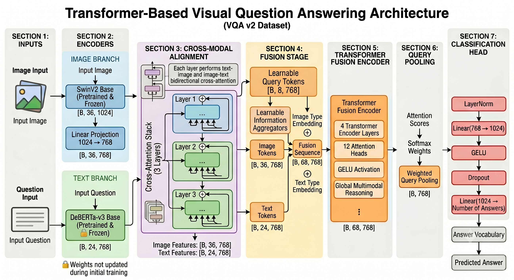

# 🖼️ Visual Question Answering (VQA) using SwinV2, DeBERTa and Cross-Modal Transformers

## 📖 Project Overview

Visual Question Answering (VQA) is a challenging multimodal AI task where a model must understand both an image and a natural language question to generate the correct answer.

This project implements a modern Transformer-based VQA architecture that combines powerful pretrained vision and language models with deep cross-modal reasoning. Instead of relying on simple feature concatenation, the model performs multiple rounds of interaction between visual and textual representations before making a prediction.

The architecture integrates:

* **SwinV2 Base** for visual understanding
* **DeBERTa-v3 Base** for language understanding
* **Stacked Bidirectional Cross-Attention** for multimodal alignment
* **Transformer Fusion Encoder** for joint reasoning
* **Learnable Query Tokens** for answer aggregation

The goal is to enable the model to learn fine-grained relationships between image regions and question semantics, improving reasoning ability on complex visual scenes.

---

## 📍 Table of Contents

* Project Overview
* Architecture Overview
* Model Pipeline
* Key Features
* Results
* Project Structure
* Dataset Setup
* Installation
* Training
* Evaluation
* Inference
* Future Improvements
* Learning Outcomes
* References

---

# 🎯 Objective

Build a deep multimodal reasoning system capable of:

* Understanding visual content
* Understanding natural language questions
* Aligning image and text representations
* Performing cross-modal reasoning
* Predicting accurate answers from a predefined answer vocabulary

---

# 🏗️ Architecture Overview



The model consists of five major stages:

## 1️⃣ Visual Encoder

### SwinV2 Base

The image is processed using a pretrained SwinV2 transformer backbone.

**Output:**

```text
[B, 36, 1024]
```

where:

* B = Batch Size
* 36 = Visual Tokens
* 1024 = Feature Dimension

### Benefits

* Hierarchical feature extraction
* Strong visual representation
* Efficient transformer architecture
* Pretrained on ImageNet-22K

---

## 2️⃣ Text Encoder

### DeBERTa-v3 Base

Questions are encoded using Microsoft's DeBERTa-v3 model.

**Output:**

```text
[B, 24, 768]
```

### Benefits

* Context-aware token representations
* Strong language understanding
* Superior performance over standard BERT models

---

## 3️⃣ Cross-Modal Alignment

The image and text representations are projected into a shared embedding space.

### Image Projection

```text
1024 → 768
```

This enables compatibility between visual and textual embeddings.

---

### Stacked Bidirectional Cross-Attention

The model applies **3 Cross-Attention Blocks** sequentially.

Each block performs:

### Text → Image Attention

Question tokens attend to image features.

This allows the model to identify:

* Relevant objects
* Regions of interest
* Visual attributes

---

### Image → Text Attention

Image features attend to question tokens.

This allows visual regions to focus on important words.

---

### Additional Components

Each Cross-Attention block includes:

* Multi-Head Attention
* Residual Connections
* Layer Normalization
* Feed Forward Networks
* GELU Activation

This iterative refinement progressively aligns both modalities.

---

## 4️⃣ Transformer Fusion Encoder

After alignment:

### Learnable Type Embeddings

The model adds:

* Image Type Embedding
* Text Type Embedding

to distinguish modalities.

---

### Learnable Query Tokens

Eight trainable query tokens are prepended:

```text
[B, 8, 768]
```

These tokens act as information collectors.

---

### Combined Sequence

```text
[Query Tokens]
+
[Image Tokens]
+
[Text Tokens]
```

Result:

```text
[B, 68, 768]
```

This sequence is processed through a multi-layer Transformer Encoder.

---

### Purpose

The fusion encoder enables:

* Global reasoning
* Long-range dependencies
* Image-text interaction
* Context aggregation

---

## 5️⃣ Query Pooling & Classification

The first 8 query tokens are extracted.

A learnable attention pooling layer computes:

```text
Importance Score
→ Softmax
→ Weighted Sum
```

This produces a single multimodal representation:

```text
[B, 768]
```

which is passed through a classifier to predict the final answer.

---

---

# ⭐ Key Features

* Transformer-based multimodal architecture
* SwinV2 visual backbone
* DeBERTa-v3 language backbone
* Bidirectional cross-attention
* Transformer fusion encoder
* Learnable query-token reasoning
* End-to-end VQA pipeline
* HuggingFace Transformers integration
* PyTorch implementation

---

# 📊 Results

| Metric              | Score |
| ------------------- | ----- |
| Strict Accuracy     | 52%   |
| Soft Accuracy       | 63%   |


---

# 📁 Project Structure

```text
VQA-Multimodal-System/
│
├── app.py
├── train.py
├── evaluation.py
├── infer.py
├── requirements.txt
│
├── models/
│   ├── image_encoder.py
│   ├── text_encoder.py
│   ├── attention.py
│   ├── fusion.py
│   └── vqa_model.py
│
├── datasets/
│
├── checkpoints/
│
├── utils/
│
├── assets/
│   └── architecture.png
│
└── README.md
```

---

# 📂 Dataset Setup

This project uses:

### VQA v2.0

* Questions
* Annotations

### MS COCO 2014

* Training Images
* Validation Images

Directory structure:

```text
data/
├── images/
│   ├── train2014/
│   └── val2014/
│
├── questions/
│   ├── train.json
│   └── val.json
│
└── annotations/
    ├── train.json
    └── val.json
```

---

# 🚀 Installation

Clone repository:

```bash
git clone https://github.com/Jayesh-2006/VQA-Multimodal-System.git

cd VQA-Multimodal-System
```

Install dependencies:

```bash
pip install -r requirements.txt
```

---

# 🏋️ Training

Train the model:

```bash
python train.py
```

Training includes:

* SwinV2 feature extraction
* DeBERTa encoding
* Cross-modal alignment
* Fusion reasoning
* Answer classification

---

# 📈 Evaluation

Evaluate on validation set:

```bash
python evaluation.py
```

Metrics:

* Accuracy
* Soft Accuracy
* Validation Loss

---

# 🔍 Inference

Run inference:

```bash
python infer.py
```

Example:

```text
Question:
What color is the umbrella?

Prediction:
Blue
```

---

# 🔮 Future Improvements

Planned enhancements:

* SwinV2 fine-tuning
* DeBERTa fine-tuning
* More Cross-Attention layers
* Better answer vocabulary generation
* Contrastive multimodal pretraining
* BLIP-style query transformer
* LoRA fine-tuning
* Flash Attention integration
* Larger vision-language backbones

---

# Learning Outcomes

This project provided practical experience in:

### Computer Vision

* Vision Transformers
* Swin Transformers
* Feature Extraction

### NLP

* Transformer Language Models
* DeBERTa Architecture
* Contextual Embeddings

### Multimodal AI

* Cross-Attention
* Fusion Mechanisms
* Vision-Language Learning

### Deep Learning Engineering

* PyTorch
* HuggingFace Transformers
* GPU Training
* Mixed Precision Training

---

# 📚 References

1. VQA v2.0 Dataset
2. MS COCO Dataset
3. Swin Transformer V2
4. DeBERTa-v3
5. Attention Is All You Need
6. Vision Transformer (ViT)
7. BLIP
8. ViLBERT
9. LXMERT

---

# 📄 License

This project is licensed under the MIT License.

---
